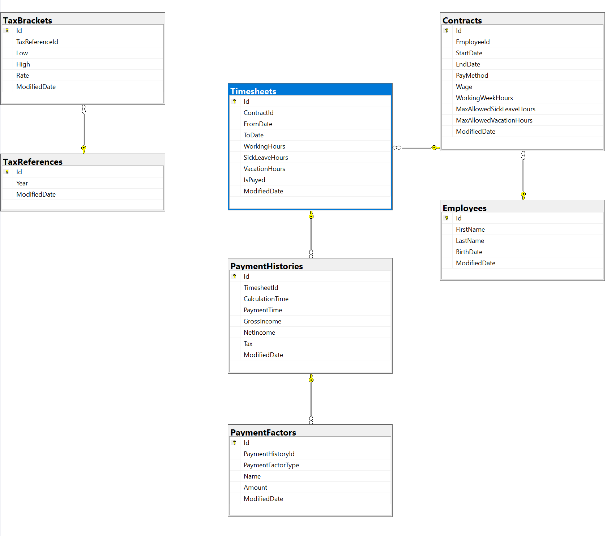
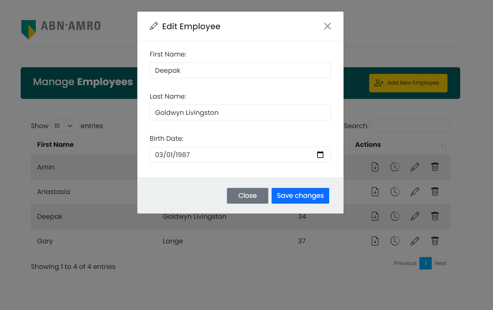
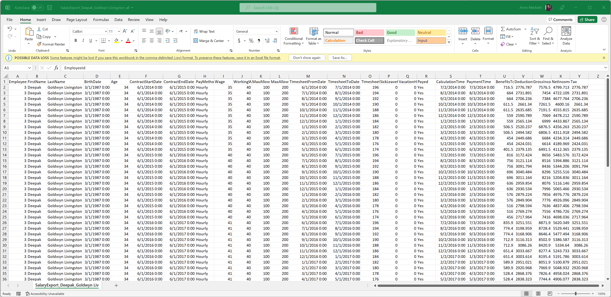
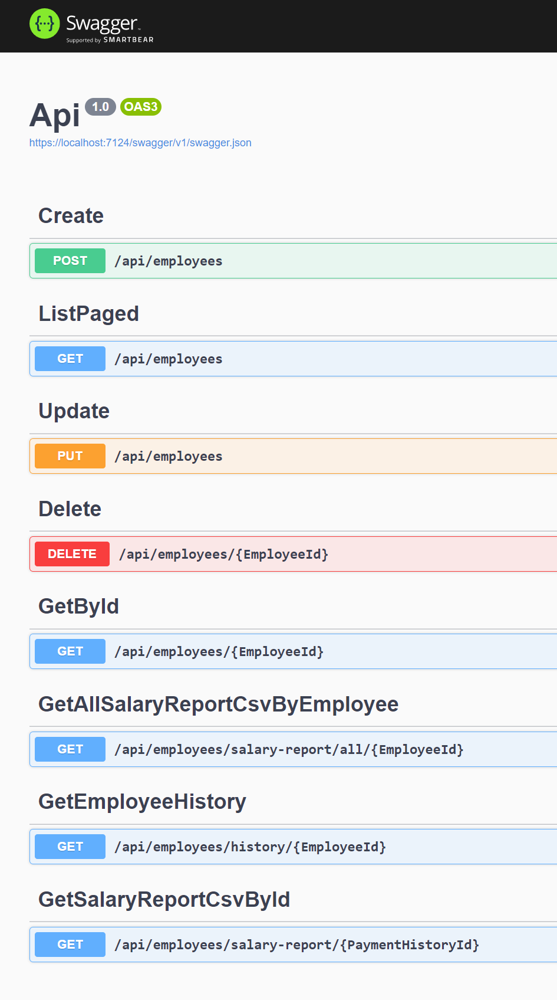

# Technical assessment, Payroll System

> My assumption in designing and implementing this project was demonstrating of abilities, in a short time and within an uncertain declaration about requirements and desires, I tried to make footprints and signs about prooving my expertise in .NET and software engineering.

> ### Known Issues:
> * Domain objects should have data type attributes ```[Required], [MaxLength(60)]``` **Why I didn't?** you can find */db_scripts/Table_Employee.sql*, this is the structure and documentaion I preffer for creating database structure using SSDT (SQL Server Data Studio) becuase it is maintainable, version-control enabled and much more accurate than basic migration approach.
> * Unit tests are as little as you find out I know what unit test is. In real-world scenarios (TDD approach), first, we have to clarify the requirement, then develop tests into *[Fail --> Pass --> Refactor]* steps. So writing Fixtures and calculating *Covering Index* and other testing considerations (Integration test, functional test, etc.) are out of the task assignment time limits but *necessary* in the real world.

## Live demo
* [API (swagger)](https://api.payroll.mesbahi.net/swagger/index.html)
* [Web UI](https://web.payroll.mesbahi.net)

You can download .csv report for all contracts and payments of an employee, or only for specific timesheet.
## Intro
In this project, I designed the following scenario:
+ Employee
+ Contract: each employee can have many contracts, for example for each year, within the cantract we can define the:
    - Start Date of the contract
    - End Date of the contract
    - Payment Method (Fixed monthly, Hourly)
    - Wage
    - WorkingWeekHours
    - MaxAllowedSickLeaveHours
    - MaxAllowedVacationHours
+ Timesheet: each contract requires monthly timesheet to calculating the salary using following fields:
    - From Date: for example Oct 1 2021
    - To Date: for example Oct 30 2021
    - WorkingHours
    - SickLeaveHours
    - VacationHours
    - IsPayed
+ Payment History: after getting the timesheet of month, we calculate the salary in store the details in the payment history, it has a child table to storing **Deductions** and **Benfits** in the **PaymentFactors** table
    - CalculationTime
    - PaymentTime
    - PaymentFactors (List<PaymentFactor>)
    - GrossIncome
    - NetIncome
    - Tax
+ TaxReference: this table is the parent of TaxBrackets to storing the Tax steps in each year




## Project Structure
+ ApplicationCore
+ Infrastructure
+ Api
+ Web


# Screenshots









### **Scenario**
You are tasked to support the salary admin of a small company. This department has two main responsibilities:
* Capturing the details of new employees
* Exporting a csv with the calculated salary of each employee

For the current employees, at least the following information is stored in the database:

* First name
* Last name
* Age 
* Salary history

The solution should contain logic to calculate the net salary based on the gross salary. Do this based on factors such as working week hours, pension contribution, et cetera (be creative!).

## Implementation 

### Backend
* Using Visual Studio create a database project which stores employee data and salary history
* Provide functionality that calculates the salary for each employee
* Provide unit tests for this functionality
+ Create a Web API that exposes functionality to
    - Add/Edit/Delete Employees
    - Generate a salary report consisting of salaries of each employee in csv format

### Frontend
* Using Visual Studio/Visual Studio Code create a Web Application that allows users to Add/Edit/Update Employees
* Provide a button on the UI that allows users to Download a Salary Report consisting of salaries of each employee in csv format.
